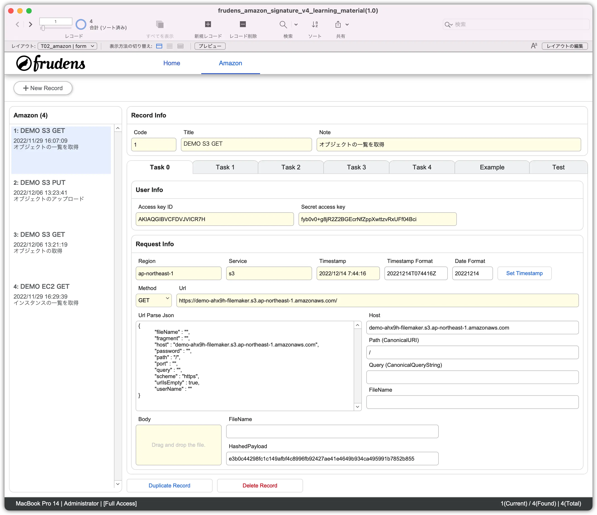
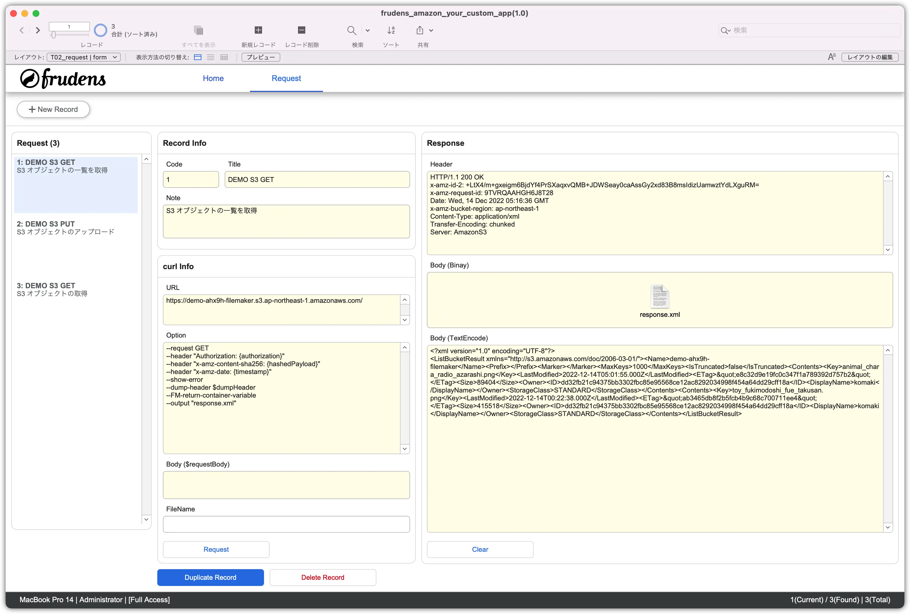
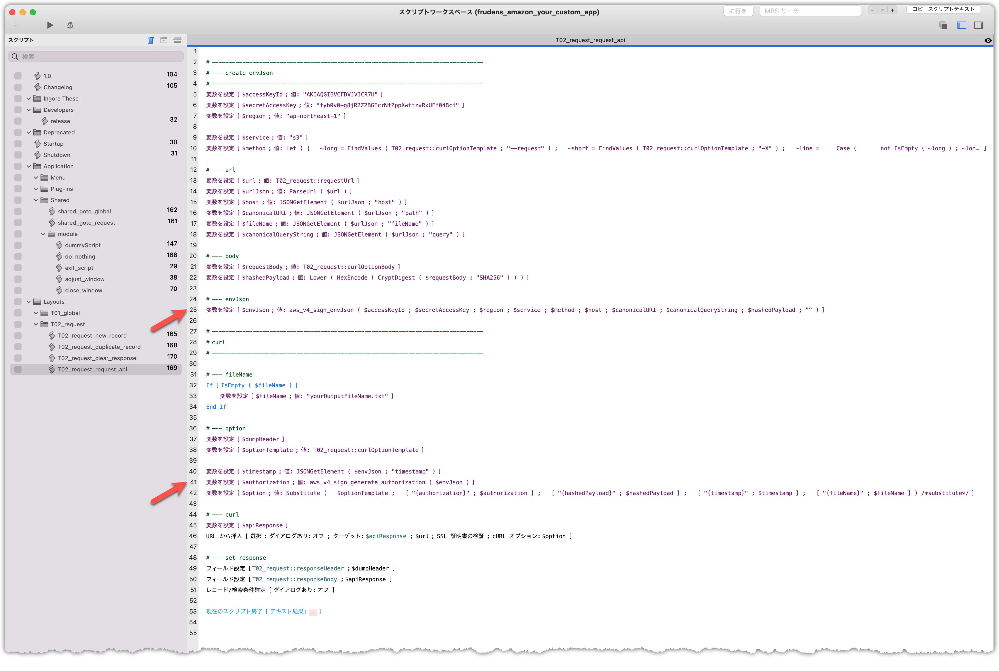

# aws-api-sig-v4-filemaker

## Blog

### Japanese

-  [FileMaker から S3 や EC2 などの AWS の API を利用する方法](https://frudens.jp/how-to-use-aws-apis-s3-ec2-from-filemaker)

### English

- I am writing.

## Account

```
AccountName = Administrator
Password = administrator
```

## File

### frudens_amazon_signature_v4_learning_material.fmp12

- This is a sample file for learning.



### frudens_amazon_your_custom_app.fmp12

- A file for custom functions to include in your custom app.



## CustomFunction

### aws_v4_sign_envJson

```
aws_v4_sign_envJson ( _accessKeyId ; _secretAccessKey ; _region ; _service ; _method ; _host ; _canonicalURI ; _canonicalQueryString ; _hashedPayload ; _optionJsonObject )

--------------------------------------------------

Let ( [

  ~timestamp = GetAsTimestamp ( Int ( Get ( CurrentTimeUTCMilliseconds ) / 1000 ) ) ;
  ~date = GetAsDate ( ~timestamp ) ;
  ~dateY = Year ( ~date ) ;
  ~dateM = Right ( "0" & Month ( ~date ) ; 2 ) ;
  ~dateD = Right ( "0" & Day ( ~date ) ; 2 ) ;

  ~time = GetAsTime ( ~timestamp ) ;
  ~timeH =  Right ( "0" & Hour ( ~time ) ; 2 ) ;
  ~timeM = Right ( "0" & Minute ( ~time ) ; 2 ) ;
  ~timeS = Right ( "0" & Seconds ( ~time ) ; 2 ) ;

  ~timestampFormat = ~dateY & ~dateM & ~dateD & "T" & ~timeH & ~timeM & ~timeS & "Z" ;
  ~dateFormat = ~dateY & ~dateM & ~dateD ;

  ~envJson =
    JSONSetElement ( _optionJsonObject ;
      [ "accessKeyId" ; _accessKeyId ; JSONString ] ;
      [ "secretAccessKey" ; _secretAccessKey ; JSONString ] ;

      [ "region" ; _region ; JSONString ] ;
      [ "service" ; _service ; JSONString ] ;

      [ "method" ; Upper ( _method ) ; JSONString ] ;
      [ "host" ; _host ; JSONString ] ;
      [ "canonicalURI" ; _canonicalURI ; JSONString ] ;
      [ "canonicalQueryString" ; _canonicalQueryString ; JSONString ] ;
      [ "hashedPayload" ; _hashedPayload ; JSONString ] ;

      [ "timestamp" ; ~timestampFormat ; JSONString ] ;
      [ "date" ; ~dateFormat ; JSONString ]
    )

] ;

~envJson

) /*let*/
```

### aws_v4_sign_generate_authorization ( _envJson )

```
aws_v4_sign_generate_authorization ( _envJson )

--------------------------------------------------

Let ( [

  // env
  ~isJson = not Exact ( Left ( JSONFormatElements ( _envJson ) ; 1 ) ; "?" ) ;
  ~env = If ( ~isJson ; _envJson ; "{}" )   ;
  ~timestamp = JSONGetElement ( ~env ; "timestamp" ) ;
  ~date = JSONGetElement ( ~env ; "date" ) ;
  ~region = JSONGetElement ( ~env ; "region" ) ;
  ~service = JSONGetElement ( ~env ; "service" ) ;

  // CanonicalRequest
  ~method = Upper ( JSONGetElement ( ~env ; "method" ) ) ;
  ~canonicalURI = JSONGetElement ( ~env ; "canonicalURI" ) ;
  ~canonicalQueryString = JSONGetElement ( ~env ; "canonicalQueryString" ) ;

  ~header1 = "host:" & JSONGetElement ( ~env ; "host" ) ;
  ~header2 = "x-amz-content-sha256:" & JSONGetElement ( ~env ; "hashedPayload" ) ;
  ~header3 = "x-amz-date:" & ~timestamp ;
  ~canonicalHeaders = List ( ~header1 ; ~header2 ; ~header3 ) ;

  ~signedHeaders = "host;x-amz-content-sha256;x-amz-date" ;
  ~hashedPayload = JSONGetElement ( ~env ; "hashedPayload" ) ;

  ~canonicalRequest = ~method & "¶" & ~canonicalURI & "¶" & ~canonicalQueryString & "¶" & ~canonicalHeaders & "¶" & "¶" & ~signedHeaders & "¶" & ~hashedPayload ;

  // HashCanonicalRequest
  ~hashCanonicalRequest = Lower ( HexEncode ( CryptDigest ( TextEncode ( ~canonicalRequest ; "utf-8" ; 3 ) ; "SHA256" ) ) ) ;

  // CredentialScope
  ~credentialScope  = ~date & "/" & ~region & "/" & ~service & "/aws4_request" ;

  // StringToSign
  ~stringToSign = List ( "AWS4-HMAC-SHA256" ; ~timestamp ; ~credentialScope ; ~hashCanonicalRequest ) ;

   // Signature
  ~kSecret = JSONGetElement ( ~env ; "secretAccessKey" ) ;
  ~kDate = CryptAuthCode ( ~date ; "SHA256" ; "AWS4" & ~kSecret ) ;
  ~kRegion = CryptAuthCode ( ~region ; "SHA256" ; ~kDate ) ;
  ~kService = CryptAuthCode ( ~service ; "SHA256" ; ~kRegion ) ;
  ~kSigning = CryptAuthCode ( "aws4_request" ; "SHA256" ; ~kService ) ;
  ~signature = Lower ( HexEncode ( CryptAuthCode ( TextEncode ( ~stringToSign ; "utf-8" ; 3 ) ; "SHA256" ; ~kSigning ) ) ) ;

   // Authorization
  ~authorizationTemplate = "{algorithm} Credential={accessKeyId}/{credentialScope}, SignedHeaders={signedHeaders}, Signature={signature}" ;
  ~authorization =
    Substitute (
      ~authorizationTemplate ;
      [ "{algorithm}" ; "AWS4-HMAC-SHA256" ] ;
      [ "{accessKeyId}" ; JSONGetElement ( ~env ; "accessKeyId" ) ] ;
      [ "{credentialScope}" ; ~credentialScope ] ;
      [ "{signedHeaders}" ; ~signedHeaders ] ;
      [ "{signature}" ; ~signature ]
    ) /*substitute*/

] ;

  ~authorization

) /*let*/
```

## Sample Script (How to Request)

### T02_request_request_api




